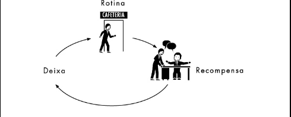

# O MODELO:
- Identifique a rotina
- Experimente com recompensas
- Isole a deixa
- Tenha um plano

## PRIMEIRO PASSO: IDENTIFIQUE A ROTINA

Os pesquisadores do MIT no capítulo 1 descobriram um loop neurológico simples no cerne de todo hábito, que consiste em três partes: uma deixa, uma rotina e uma recompensa.

Para entender seus próprios hábitos, você precisa identificar os componentes dos seus loops. Uma vez que você diagnosticou o loop do hábito de um comportamento específico, pode procurar formas de suplantar velhos atos nocivos com novas rotinas. Por exemplo, digamos que você tem o mau hábito, como eu tinha quando comecei a fazer a pesquisa para este livro, de ir até a cafeteria e comprar um cookie com chocolate toda tarde. Digamos que esse hábito fez com que você ganhasse alguns quilos a mais. Na verdade, digamos que esse hábito fez você ganhar exatamente 4 quilos, e que a sua mulher fez alguns comentários bem diretos. Você tentou se forçar a parar — até chegou a colar um Post-it no computador dizendo CHEGA DE COOKIES.

Mas toda tarde você dá um jeito de ignorar esse bilhete, andar até a cafeteria, comprar um cookie e, enquanto conversa com colegas perto do caixa, comer o cookie. Você se sente bem e depois se sente mal. Promete a si mesmo que, amanhã, vai se obrigar a ter força de vontade para resistir. Amanhã vai ser diferente. Mas amanhã o hábito se instaura de novo. Como você começa a diagnosticar e depois a mudar esse comportamento? Descobrindo qual é o loop do hábito. E o primeiro passo é identificar a rotina. Nesse exemplo dos cookies — como com a maioria dos hábitos — a rotina é o aspecto mais óbvio: é o comportamento que você quer mudar. Sua rotina é que você levanta da mesa durante a tarde, anda até a cafeteria, compra um cookie de chocolate e come enquanto conversa com amigos. Então é isso que você coloca no loop:

Agora, algumas perguntas menos óbvias: qual é a deixa para essa rotina? É a fome? O tédio? Pouco açúcar no sangue? É que você precisa de uma pausa antes de mergulhar em outra tarefa? E qual é a recompensa? O cookie em si? A mudança de cenário? A distração temporária? Socializar com colegas? Ou o surto de energia que vem dessa explosão de açúcar? Para descobrir isso, você precisará fazer um pequeno experimento.

## SEGUNDO PASSO: EXPERIMENTE COM RECOMPENSAS

As recompensas são poderosas porque satisfazem anseios. Mas muitas vezes não estamos cientes dos anseios que impelem nossos comportamentos. Quando a equipe de marketing do Febreze descobriu que os consumidores desejavam um aroma de frescor no fim de um ritual de limpeza, por exemplo, eles tinham descoberto um anseio que ninguém nem sabia que existia. Estava escondido em plena vista de todos. Os anseios, na maioria, são assim: óbvios quando pensamos neles depois, mas incrivelmente difíceis de ver quando estamos sob seu domínio. Para descobrir quais anseios estão movendo hábitos específicos, é útil experimentar com recompensas diferentes. Isso talvez leve alguns dias, ou uma semana, ou mais. Durante esse período, você não deve sentir nenhuma pressão para fazer uma mudança real — pense que você é um cientista no estágio de coleta de dados.

No primeiro dia do seu experimento, quando sentir o impulso de ir à cafeteria e comprar um cookie, ajuste sua rotina de modo que ela proporcione uma recompensa diferente. Por exemplo, em vez de andar até a cafeteria, saia do prédio, dê uma volta no quarteirão, e então volte para sua mesa sem comer nada. No dia seguinte, vá à cafeteria e compre um donut, uma barra de chocolate e coma na sua mesa. No dia seguinte, vá à cafeteria, compre uma maçã e coma enquanto conversa com seus amigos. Então, tente uma xícara de café. Em vez de ir à cafeteria, ande até a sala do seu amigo, bata papo por alguns minutos e volte para sua mesa.

Você entendeu a ideia. O que você escolhe fazer em vez de comprar um cookie não é importante. O objetivo é testar hipóteses diferentes para determinar qual anseio está impulsionando sua rotina. A sua vontade é do cookie em si, ou de fazer uma pausa no trabalho? Se é o cookie, é só porque você está com fome? (E nesse caso a maçã deveria servir tão bem quanto.) Ou é porque você quer a dose de energia que o cookie proporciona? (E então o café deveria bastar.) Ou você está indo à cafeteria como desculpa para socializar, e o cookie é só uma desculpa conveniente? (Se for, andar até a mesa de alguém e bater papo por alguns minutos deve satisfazer o impulso.)

Enquanto testa quatro ou cinco recompensas diferentes, você pode usar um velho truque para procurar padrões: depois de cada atividade, anote num pedaço de papel as primeiras três coisas que vierem à sua mente quando você voltar para sua mesa. Podem ser emoções, pensamentos aleatórios, reflexões sobre como você está se sentindo, ou apenas as primeiras três palavras que surgirem na sua cabeça.

Então, programe um alarme no seu relógio ou computador para 15 minutos. Quando ele tocar, pergunte a si mesmo: Você ainda sente o impulso de comer aquele cookie?

Escrever três coisas — mesmo se forem palavras sem sentido — é importante por dois motivos. Primeiro, isso força uma consciência momentânea do que você está pensando ou sentindo. Assim como Mandy, a roedora de unhas do capítulo 3, carregava uma ficha cheia de marquinhas para forçá-la a estar ciente de seus impulsos habituais, escrever três palavras obriga você a ter um momento de atenção. Além disso, estudos indicam que anotar umas poucas palavras ajuda você a lembrar depois do que estava pensando naquele momento. Ao fim do experimento, quando você reler suas anotações, será muito mais fácil lembrar o que estava pensando e sentindo naquele exato instante, pois as palavras que você escreveu vão despertar uma onda de memória.

E por que o alarme de 15 minutos? Porque a ideia desses testes é determinar qual é a recompensa pela qual você está ansiando. Se, 15 minutos depois de comer um donut, você ainda sentir um impulso de levantar e ir à cafeteria, então seu hábito não é motivado pelo desejo de açúcar. Se, depois de bater papo na mesa de um colega, você ainda quiser um cookie, então a necessidade de contato humano não é o que está movendo seu comportamento.

Por outro lado, se 15 minutos após conversar com um amigo você achar fácil voltar ao trabalho, então você identificou a recompensa — distração temporária e socialização — que seu hábito procurava satisfazer.

Experimentando diferentes recompensas, você pode isolar qual é realmente o seu anseio, algo essencial para reestruturar o hábito.

Uma vez que você descobriu a rotina e a recompensa, só falta identificar a deixa.

## TERCEIRO PASSO: ISOLE A DEIXA

Há cerca de uma década, uma psicóloga da University of Western Ontario tentou responder uma pergunta que vinha deixando os cientistas sociais perplexos havia anos: por que algumas testemunhas oculares de crimes se enganam ao se lembrar do que viram, enquanto outras lembram corretamente dos acontecimentos?

As lembranças de testemunhas oculares, é claro, são importantíssimas. No entanto, estudos indicam que testemunhas oculares muitas vezes lembram equivocadamente do que observaram. Insistem que o ladrão era um homem, por exemplo, quando na verdade era uma mulher de saia; ou que o crime ocorreu quando estava escurecendo, embora os boletins da polícia digam que foi às duas da tarde. Outras testemunhas oculares, por outro lado, conseguem se lembrar de crimes que viram com uma memória quase perfeita.

Dezenas de estudos investigaram esse fenômeno, tentando descobrir por que algumas pessoas são melhores testemunhas oculares do que outras. Pesquisadores especularam que algumas pessoas simplesmente têm memórias melhores, ou que um crime que ocorre num lugar bem conhecido é mais fácil de lembrar. Mas essas teorias não se provaram verdadeiras — pessoas com memórias fortes e fracas, ou mais e menos familiaridade com a cena de um crime, estavam igualmente sujeitas a lembrar incorretamente o que aconteceu.

A psicóloga da University of Western Ontario tentou uma abordagem diferente. Imaginou que talvez os pesquisadores estivessem cometendo um engano ao focar naquilo que os interrogadores e as testemunhas tinham dito, e não em como eles estavam dizendo isso. Ela suspeitava haver deixas sutis que estavam influenciando o processo do interrogatório. Mas quando assistiu a fitas e mais fitas de entrevistas com testemunhas, procurando essas deixas, ela não conseguiu ver nada. Havia tanta atividade em cada entrevista — todas as expressões faciais, os jeitos diferentes como as perguntas eram feitas, as emoções flutuantes — que ela não conseguiu detectar nenhum padrão.

Então ela teve uma ideia: fez uma lista com uns poucos elementos nos quais ia se concentrar — o tom de voz dos interrogadores, as expressões faciais da testemunha, e quão perto um do outro a testemunha e o interrogador estavam sentados. Então ela retirou quaisquer informações que fossem distraí-la desses elementos. Baixou o volume da televisão para que, em vez de ouvir as palavras, só conseguisse detectar o tom de voz do interrogador. Colou uma folha de papel no rosto do interrogador, para que só pudesse ver as expressões das testemunhas. Pôs uma fita métrica na tela para medir a distância entre um e outro.

E depois que ela começou a estudar esses elementos específicos, os padrões saltaram aos seus olhos. Ela viu que testemunhas que se lembravam de fatos incorretos geralmente eram interrogadas por policiais com um tom de voz gentil, amistoso. Quando as testemunhas sorriam mais, ou sentavam mais perto da pessoa que estava fazendo as perguntas, elas tinham mais chances de se enganar ao lembrar.

Em outras palavras, quando as deixas da situação diziam “somos amigos” — um tom gentil, um rosto sorridente —, as testemunhas tinham mais chances de lembrar incorretamente do que acontecera. Talvez fosse porque, inconscientemente, essas deixas de amizade deflagrassem um hábito de agradar o interrogador.

Mas a importância desse experimento é que as mesmas fitas tinham sido assistidas por dezenas de outros pesquisadores. Várias pessoas inteligentes tinham visto os mesmos padrões, mas ninguém os reconhecera antes. Porque havia informações demais em cada fita para que alguém visse uma deixa sutil. Uma vez que a psicóloga decidiu focar apenas três categorias de comportamento, no entanto, e eliminar as informações que não fossem relevantes a elas, os padrões saltaram aos olhos.

Nossas vidas são assim também. O motivo para que seja tão difícil identificar as deixas que deflagram nossos hábitos é porque há informações demais nos bombardeando enquanto nossos comportamentos se manifestam. Pergunte a você mesmo, você toma café da manhã num certo horário todo dia porque está com fome? Ou porque o relógio diz que são sete e meia? Ou porque seus filhos começaram a comer? Ou porque você está vestido, e é nesse momento que o hábito do café da manhã entra em ação?

Quando você automaticamente vira seu carro à esquerda no caminho para o trabalho, o que desencadeia seu comportamento? Uma placa de rua? Uma árvore específica? Saber que esta é, de fato, a rota certa? Todos esses fatores juntos? Quando você está levando seu filho para a escola e descobre que, por distração, começou a fazer o caminho para o trabalho — e não para a escola —, o que provocou o erro? Qual foi a deixa que fez com que o hábito “dirigir para o trabalho” entrasse em ação em vez do padrão “dirigir para a escola”?

Para identificar uma deixa em meio ao ruído, podemos usar o mesmo sistema que a psicóloga: identificar de antemão categorias de comportamentos para examiná-los e enxergar os padrões. Por sorte, a ciência nos oferece alguma ajuda nesse sentido. Experimentos mostraram que quase todas as deixas habituais se encaixam em uma entre cinco categorias:

Lugar
- Hora
- Estado emocional
- Outras pessoas
- Ação imediatamente anterior

Por isso, se está tentando descobrir a deixa para o hábito “ir à cafeteria e comprar um cookie de chocolate”, você anota cinco coisas no instante em que o impulso surge (estas são minhas notas reais de quando eu estava tentando diagnosticar meu hábito):

- Onde você está? (sentado na minha mesa)
- Que horas são? (3h36 da tarde)
- Qual é seu estado emocional? (entediado)
- Quem mais está por perto? (ninguém)
- Qual foi a ação anterior ao impulso? (respondi um e-mail)

No dia seguinte:

- Onde você está? (voltando da copiadora)
- Que horas são? (3h18 da tarde)
- Qual é seu estado emocional? (feliz)
- Quem mais está por perto? (o Jim, da seção de Esportes)
- Qual foi a ação anterior ao impulso? (tirei uma cópia)

No terceiro dia:

- Onde você está? (sala de reuniões)
- Que horas são? (3h41 da tarde)
- Qual é seu estado emocional? (cansado, empolgado com o projeto no qual estou trabalhando)
- Quem mais está por perto? (editores que estão vindo para esta reunião)
- Qual foi a ação anterior ao impulso? (sentei porque a reunião está prestes a começar)

Depois de três dias, ficou bastante claro qual era a deixa que estava deflagrando meu hábito de comer cookies — eu sentia um impulso de fazer um lanche numa certa hora do dia. Eu já tinha descoberto, no segundo passo, que não era a fome que estava movendo meu comportamento. A recompensa que eu estava buscando era uma distração temporária — do tipo que alguém obtém batendo papo com um amigo. E o hábito, eu agora sabia, era despertado entre três e quatro horas.

## QUARTO PASSO: TENHA UM PLANO

Uma vez que descobriu qual é o loop do seu hábito — você identificou a recompensa que está movendo seu comportamento, a deixa que o deflagra e a rotina em si —, você pode começar a alterar o comportamento. Pode mudar para uma rotina melhor, planejando-se para a deixa e escolhendo um comportamento que ofereça a recompensa pela qual você está ansiando. É de um plano que você precisa.

No prólogo, aprendemos que um hábito é uma escolha que em algum momento tomamos deliberadamente, e depois paramos de pensar a respeito, porém continuamos fazendo, às vezes todo dia.

Dito de outro modo, um hábito é uma fórmula que nosso cérebro segue automaticamente: Quando eu vejo DEIXA, vou fazer ROTINA para obter RECOMPENSA.

Para reprogramar essa fórmula, precisamos começar a fazer escolhas outra vez. E o jeito mais fácil de fazer isso, de acordo com inúmeros estudos, é ter um plano. Dentro da psicologia, esses planos são conhecidos como “intenções de implementação”.

Pensemos, por exemplo, no meu hábito de comer um cookie à tarde. Usando este modelo, descobri que minha deixa era por volta das três e meia. Eu sabia que minha rotina era ir à cafeteria, comprar um cookie e conversar com amigos. E fazendo experimentos, descobri que na verdade não era pelo cookie que eu ansiava — mas sim por um momento de distração e uma oportunidade de socializar.

Então eu tracei um plano:

- Às três e meia, todo dia, vou andar até a mesa de um amigo e conversar por dez minutos.

Para garantir que me lembraria de fazer isso, programei o alarme no meu relógio para as três e meia.

O plano não funcionou imediatamente. Havia dias em que eu estava ocupado demais e ignorava o alarme, e então caía do cavalo. Outras vezes parecia ser trabalhoso demais encontrar um amigo disposto a bater papo — era mais fácil comprar um cookie, e por isso eu cedia ao impulso. Porém, nos dias em que seguia meu plano — quando meu alarme tocava, eu me forçava a andar até a mesa de um amigo e conversar por dez minutos —, eu descobria que terminava o expediente me sentindo melhor. Eu não tinha ido à cafeteria, não tinha comido um cookie e me sentia bem. Por fim, passou a ser automático: quando o alarme tocava, eu achava um amigo e terminava o dia com uma pequena, porém real sensação de conquista. Após umas poucas semanas, eu quase nem pensava mais na rotina. E quando não achava ninguém para bater papo, ia à cafeteria, comprava um chá e o bebia com amigos.

Isso tudo aconteceu há cerca de seis meses. Já não tenho mais esse relógio — eu o perdi em algum momento. Mas todo dia, por volta das três e meia, eu distraidamente levanto da mesa, procuro na sala da redação alguém para conversar, passo dez minutos batendo papo sobre as notícias, e então volto para minha mesa. Isso acontece quase sem que eu pense a respeito. Tornou-se um hábito.

Obviamente, alguns hábitos podem ser mais difíceis de mudar. Mas esse modelo é um ponto de partida. Às vezes a mudança leva um bom tempo. Às vezes exige uma série de experimentos e fracassos. Mas, uma vez que você entende como um hábito funciona — que diagnostica a deixa, a rotina e a recompensa —, você ganha poder sobre ele.
